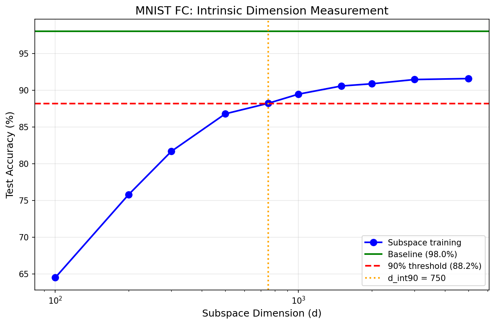

# Intrinsic Dimension Reimplementation


PyTorch reimplementation of the ICLR 2018 paper *Measuring the Intrinsic Dimension of Objective Landscapes*, with classic experiments on toy problems, MNIST, CIFAR-10, RL, and ImageNet-scale models, plus an optional ViT transfer-learning extension.

The core idea is to train a low-dimensional vector `d` and recover full parameters with a random projection:

```text
theta = theta_0 + P @ d
```

The main metric is `d_int90`: the smallest tested subspace dimension that reaches 90% of baseline performance.

## Setup

```bash
python -m venv .venv
# Windows
.venv\Scripts\activate
# macOS / Linux
# source .venv/bin/activate

pip install -r requirements.txt
```

For older Python / PyTorch stacks, `requirements.vit_py37.txt` is also included.

## Quick Start

Fastest sanity check:

```bash
python test_compatibility.py
python experiments/toy_problem.py
```

Common classic-paper runs:

```bash
python experiments/mnist_fc.py
python experiments/mnist_lenet.py
python experiments/mnist_fc_variants.py
python experiments/projection_comparison.py
python scripts/run_all_experiments.py --experiments toy,mnist_fc,mnist_lenet --quick
```

Generate summary figures:

```bash
python scripts/generate_figures.py
python scripts/generate_paper_figures.py
```

Preview the ViT extension plan:

```bash
python scripts/run_vit_intrinsic_plan.py --phase all --dry_run
```

## Implementation Focus

- `src/models/subspace.py` is the core wrapper that turns a normal model into a subspace-trained model
- dense, sparse, and Fastfood projections are all supported; Fastfood is the practical choice for large models
- utilities in `src/utils/metrics.py` estimate `d_int90` and summarize compression behavior
- the repo includes both the original paper-style experiments and a newer ViT + LoRA + intrinsic-dimension branch for transfer-learning studies

## Representative Results

The classic reimplementation tracks the paper's main story:

- MNIST FC: `d_int90 ~ 750`
- MNIST LeNet: `d_int90 ~ 275`
- CIFAR-10 LeNet: `d_int90 ~ 2900`
- CartPole: `d_int90 ~ 25`
- ImageNet SqueezeNet: `d_int90 > 500000`

These numbers show that the effective degrees of freedom can be far smaller than raw parameter count, but they still depend strongly on task and architecture.

## Visual Summary



This is the core picture behind the repository. As the random subspace dimension grows, performance rises until it reaches 90% of the full-model baseline; here that threshold is `d_int90 = 750`, which is much smaller than the full parameter count.

## License

MIT
